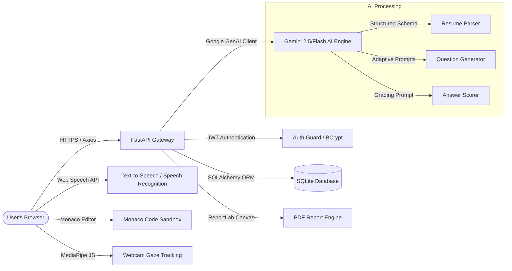
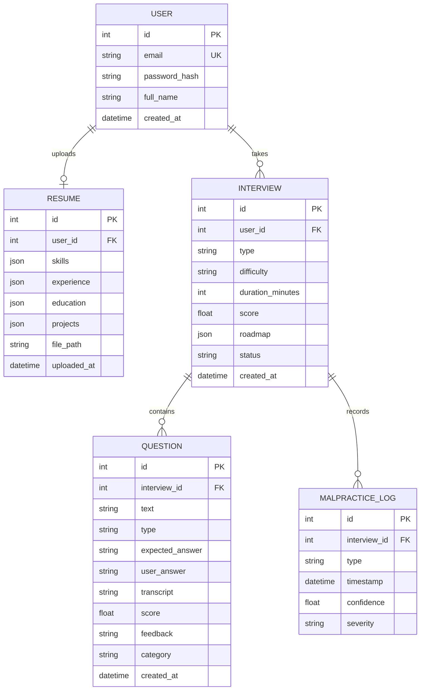

# System Architecture & Design - IntervueAI

IntervueAI is architected around a modern full-stack web application structure that decouples the frontend client from the backend services. It prioritizes offline-first safety verification, reactive user flows, and structured data outputs from generative AI engines.

---

## 1. High-Level Architecture



---

## 2. Directory Structure and Component Mapping

```text
IntervueAI/
├── backend/                  # FastAPI Application
│   ├── app/
│   │   ├── api/              # API router gateways
│   │   │   └── v1/           # API endpoints (auth, resumes, interviews, coding)
│   │   ├── core/             # Base configurations (security, database engine)
│   │   ├── models/           # SQLAlchemy database schemas
│   │   ├── schemas/          # Pydantic validation models
│   │   ├── services/         # Third-party integrations (gemini, report lab, pdf parsers)
│   │   └── main.py           # Application entrypoint and middleware
│   ├── requirements.txt      # Python dependencies
│   └── run.py                # Server runner utility (Uvicorn configuration)
│
└── frontend/                 # Vite + React + TypeScript App
    ├── public/               # Public assets
    └── src/
        ├── assets/           # Global stylesheets and fonts
        ├── components/       # Shared reusable UI elements
        ├── context/          # React Auth and Interview Context hooks
        ├── hooks/            # Hardware stream validation hooks
        ├── pages/            # View components (Landing, Setup, Dashboard, Live, Coding, Report)
        ├── services/         # Axios API connection instance
        ├── types/            # TypeScript interfaces
        └── App.tsx           # React Router mapping
```

---

## 3. Database Schema Design (SQLAlchemy)

The application uses an relational database layout to map users to their profiles, uploaded resumes, multiple mock sessions, individual question results, and malpractice warnings:



---

## 4. Key Architectural Design Decisions

### 4.1. Client-Side Speech & Media Processing
- **Web Speech API**: Transcription and text-to-speech are processed natively inside the user's browser via the Web Speech API (`SpeechRecognition` and `SpeechSynthesis`). This removes the need for transferring large, multi-megabyte audio tracks to the server.
- **MediaPipe JS Client-Side Tracking**: Face detection, looking-away monitoring, and tab focus loss (`visibilitychange` API) are captured client-side in the browser. When an infraction is detected, a lightweight log payload is dispatched to the backend database `/api/v1/interviews/{id}/malpractice`. This saves server CPU and bandwidth.

### 4.2. Pure Python Parsing with zero binary builds
- **pypdf**: By using `pypdf` rather than `PyMuPDF` or `pdfminer`, we avoid the requirement for Visual Studio C++ compilers on Windows or system binary compiling on Linux during installation.
- **Direct bcrypt**: Direct imports of `bcrypt` password hashing instead of using legacy `passlib` layers ensures seamless execution under Python 3.12/3.13/3.14.

### 4.3. Schema-Forced Gemini Outputs
We use Gemini's structured response schema feature to guarantee that the AI returns exact JSON layouts:
- Resumes are forced to match the `ResumeSchema` structure.
- Coding questions are structured into `title`, `starter_code`, `test_cases`, and `language` parameters.
- Evaluations are structured into actionable `suggestions`, `roadmap`, and `skill_scores`.
This guarantees that the application never breaks due to unstructured raw text return blocks from the AI.
